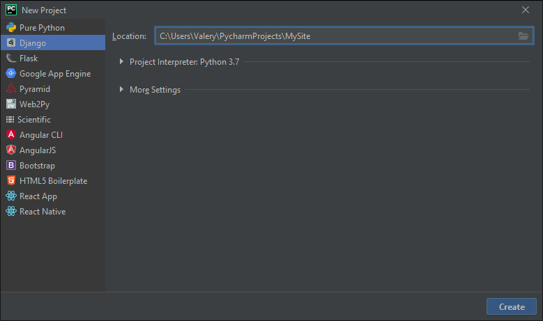
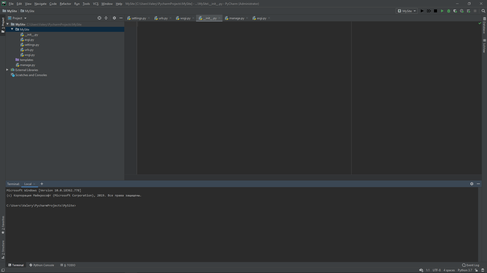

# Часть первая. Выбор IDE, фреймворка и настройка пустого проекта

**Цель:** Подготовить Python к работе над создание сайта

**Задачи:**

* Установить библиотеку Django
* Создать проект сайта
* Настроить сервер проекта

## Установка PyCharm и всех библиотек

Для выполнения работы рекомендуется использование IDE PyCharm, так как в нём удобно организовано рабочее место со строкой терминала и дебаг-платформой.

Выбор фреймворка пал на библиотеку Django. На Django реализовано большое количество крупнейших платформ: YouTube, Google Search, DropBox, Instagram, Reddit, Pinterest, Yhoo! Maps, Spotify и многие другие проекты.

Для начала, нам необходимо скачать фреймворк. Заходим в терминал и пишем 2 команды:

```
pip install pip

pip install Django
```

Запускаем PyCharm и создаём новый Django проект



Когда мы выбираем новый Django проект, PyCharm автоматически пишет следующую команду:

```
django-admin startproject C:/Users/Valery/PycharmProjects/MySite
```

Чтобы ознакомиться со всеми возможными командами, напишите в терминале:

```
django-admin
```

Откроем созданный нами проект и заглянем в папку


В папке (я создавал MySite) мы видим ещё одну папку с тем же названием и файл manage.py. Это основной наш фал. Благодаря ему, мы можем запускать проект в терминале, выполнять отладку/изменения, запускать сервер и т.д.

Перейдём в папку MySite и в ней мы обнаружим несколько файлов: `__init__.py` – он указывает, что это пакет питона и сейчас он пуст, `asgi.py` – файл, в который можно загружать дополнения, `settings.py` – файл для глобальных настроек с документацией, `urls.py` – файл для обработки адресов страниц, `wsgi.py` – файл, указывающий способ взаимодействия с сервером.

## Изучение окружения

Откроем терминал



В нём введём команду:

```
python manage.py runserver
```


Открываем любой браузер и вводим в адресную строку




Мы запустили локальный сервер на ПК и получили доступ к сайту.

Перейдём в панель администратора введя в конце строки `/admin`


В терминале же мы видим всё, что происходило на сервере


Для выключения сервера нажмите

```
CTRL+C
```
