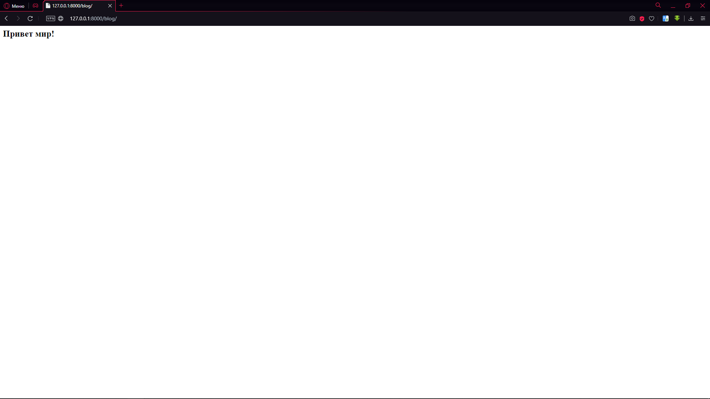

# Часть вторая. Написание страницы и отслеживание URL

**Цель:** Создать первые страницы и отследить их URL

**Задачи:**

* Создать приложение в проекте
* Создать страницы в приложении проекта
* Отладка сервера проекта

## Небольшой экскурс в историю

Весь интернет работает по одному основному протоколу и ряду дополнительных. Основной протокол – HTTP (от англ. HyperText Transfer Protocol — протокол передачи гипертекста). HTTP – это прикладной протокол передачи данных в сети. На текущий момент используется для получения информации с веб-сайтов. Протокол HTTP основан на использовании технологии «клиент-сервер»: клиент, отправляющий запрос, является инициатором соединения; сервер, получающий запрос, выполняет его и отправляет клиенту результат.

HTTP был предложен в марте 1991 года Тимом Бернерсом-Ли, работавшим тогда в CERN, как механизм для доступа к документам в Интернете и облегчения навигации посредством использования гипертекста. Самая ранняя версия протокола HTTP/0.9 была впервые опубликована в январе 1992 года (хотя реализация датируется 1990 годом).

Шли годы и опасность в интернете росла. С возрастание угроз стало необходимо шифрование. Так появился HTTPS (от англ. HyperText Transfer Protocol Secure — безопасный протокол передачи гипертекста) — это расширение протокола HTTP, поддерживающее шифрование посредством криптографических протоколов SSL и TLS, где SSL и TLS дополнили основной HTTP.

Для работы с HTTP протоколом существует свой язык – HTML. HTML (от англ. HyperText Markup Language — «язык гипертекстовой разметки») — стандартизированный язык разметки документов во Всемирной паутине. Большинство веб-страниц содержат описание разметки на языке HTML (или XHTML). Язык HTML интерпретируется браузерами; полученный в результате интерпретации форматированный текст отображается на экране монитора компьютера или мобильного устройства.

Теперь вернёмся к нашему проекту. По возвращению, мы видим новый файл – db.sqlite3. Этот файл появился после запуска сервера. Он – наша база данных и понятно, пока, пустая.

## Создание приложения

Переходим в терминал и пишем команду

```
python manage.py startapp blog
```

Мы создали новую директорию под названием blog. blog – это приложение для нашего проекта сайта «MySite».

## Пишем страницу

Открываем views.py.

.png>)

Пишем строку импорта новой библиотеки

```python
from django.http import HttpResponse
```

Напишем простую функцию

```python
def home(request):  
    return HttpResponse('<h2>Привет мир!</h2>')
```

Не забываем про pep8 (руководство по написанию кода на Python). Ссылка на полное руководство:



Теперь нам нужно её вызвать. Приступим.

В приложении blog создадим файл – `urls.py`. Для этого откроем папку с проектом. В моём случае это C:\Users\Valery\PycharmProjects\MySite\blog. Затем, создаём файл.

Обратимся к автоматически созданному файлу urls.py в папке C:\Users\Valery\PycharmProjects\MySite. Откроем его.

.png>)

Построчно разберём код

```python
from django.contrib import admin  
from django.urls import path  

urlpatterns = [  
    path('admin/', admin.site.urls),  
]
```

`from django.contrib import admin` – импорт библиотеки для создание панели администратора сайта.

`from django.urls import path` – импорт библиотеки для создание списка адресов страниц.

```python
urlpatterns = [  
    path('admin/', admin.site.urls),  
]
```

Организация списка url-файлов

Скопируем кусок в C:\Users\Valery\PycharmProjects\MySite\blog\urls.py. Копируем всё, кроме библиотеки на панель администратора. То есть:

```python
from django.urls import path  

urlpatterns = [  
    path('admin/', admin.site.urls),  
]
```

Заменим `path('admin/', admin.site.urls),` на `path('', views.home),`. Результат:

```python
from django.urls import path  

urlpatterns = [  
    path('', views.home),  
]
```

Что мы сделали? Мы вызываем главную страницу нашего проекта, то есть ([http://127.0.0.1:8000/blog/](http://127.0.0.1:8000/blog/)), а вызов идёт в файл views.py в приложении blog и обращается к функции home, которую мы создали.

Есть только 1 маленькая проблема – фатальная ошибка компиляции. Файл urls.py не «видит» файла views.py. Исправляем:

```python
from . import views
```

`from .` означает, что импорт идёт из корневой для приложения директории, то есть C:\Users\Valery\PycharmProjects\MySite\blog\\.

## Хлебные крошки

Добавим последний штрих – хлебную крошку. Верстальщики называют хлебными крошками – имена ключевых объектов/директорий/файлов и т.п. Хлебные крошки – это навигационная цепочка на сайте. Свой название оно получило по аналогии с немецкой сказкой «Гензель и Гретель», в которой дети, когда их повторно завели в лес, не смогли найти дорогу обратно, так как вместо камешков оставили хлебные крошки, которые впоследствии склевали лесные птицы.

Теперь к делу. Итоговая вёрстка файла urls.py выглядит так:

```python
from django.urls import path  
from . import views  

urlpatterns = [  
    path('', views.home, name='blog-home'),  
]
```

Теперь мы не заблудимся и вернёмся в главную директорию.

Если бы мы сейчас искали приложение blog, мы бы его не нашли. Дело в том, что в urls.py в директории C:\Users\Valery\PycharmProjects\MySite\ указана ссылка только на приложение admin. Исправим это.

```python
from django.contrib import admin  
from django.urls import path, include  

urlpatterns = [  
    path('admin/', admin.site.urls),  
    path('blog/', include('blog.urls')),  
]
```

Мы подключаем ссылку blog и все её url-файлы командой include. Чтобы она работала, мы импортируем её во второй строке.

Запускаем сервер и проверяем.

.png>)

Так и должно быть, так как на главной странице у нас ничего нет. Перейдём в blog.



Проверим admin

.png>)

Победа.

## Закрепление

Напишем ещё одну страницу для закрепления. Работаем в директории blog. Переходим в файл viewes.py и в нём пишем ещё одну функцию.

```python
def contacts(request):  
return HttpResponse('<h2>Контакты</h2>')
```

Переходим в urls.py. Пишем новую ссылку:

```python
urlpatterns = [  
    path('', views.home, name='blog-home'),  
    path('contacts/', views.contacts, name='blog-contacts'),  
]
```

Теперь у нас будет новый путь: [http://127.0.0.1:8000/blog/contacts](http://127.0.0.1:8000/blog/contacts)

Переходим на папку вверх в MySite. Заходим в файл urls.py и ничего там не меняем

Почему? Командой include('blog.urls') мы проверяем все ссылки второго уровня.

Запуск сервера. Проверка.

.png>)

Всё работает.
