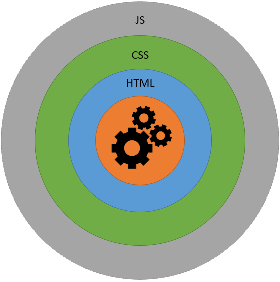

# Часть третья. HTML, CSS, JavaScript

**Цель:** Изучение основополагающих строения сайта

**Задачи:**

* Изучить устройство сайта
* Изучение основ HTML
* Изучение основ CSS
* Изучение основ JS
* Рекомендация литературы для углубления знаний

## О всех сайтах в мире

Все сайты устроены, примерно так:



Сравним человеческий организм с этим механизмом. В основе у нас кости. Как бы мы ни накачивали мышцы, ни тренировались мы не сможем повернуть голову за спину или же ходить коленками назад. Основа – кости. То, как устроен наш скелет – диктует нам как мы сможем жить.

Далее идут мышцы. Костей человека мы не видим, но догадываемся, что они есть, а вот мышцы мы видим, но не напрямую (красных сжимающихся/разжимающихся штук на теле человека не так уж обыденно). От силы и натренированности мышц зависит качество работы скелета. Человек может прыгать, бегать, шевелиться, а скелет – нет.

Кожа. Это штука не только закрывает мышцы и делает нас красивыми (кого-то просто красивее, чем раньше), но и защищает мышцы от этого сердитого мира.

Косметика. Это не только украшение и скрытие неровностей и изъянов кожи, но и дополнительный слой, питающий кожу.

Теперь о главном. Кости – это движок сайта. Он бывает написан или на PHP, или на Python. Есть ещё море CMS – автоматических движков, но это для тех, кто не может выучить язык программирования, то есть не про нас.

HTML – мышцы. Он выглядит ну очень страшно, но работает как атомные часы. Без него – сайт невозможен.

CSS – это кожа, которая скрывает ужас HTML под красивым словом «стиль». Стили не всегда красивы, но задача у них одна – «приодеть» сайт.

JavaScript – это косметика. Если вы видите, что на сайте что-то дёргается (красиво дёргается, а не в конвульсиях), перемещается и как-то иначе реагирует на курсор, клавиатуру – это JS.

Движок у нас – Python. PHP сложнее и старше. Он медленно идёт на покой. Медленно, но идёт.

## Азы HTML

Быстрый старт

Чтобы сразу же ввести в курс дела нетерпеливых читателей, предложим им возможность создания веб-страницы без последовательного изучения правил HTML. По крайней мере, вы сумеете убедиться, что создание веб-страниц достаточно простая штука.

В примере 1 приведен несложный пример такого кода.

Пример 1. Первая веб-страница

```markup
<!DOCTYPE HTML PUBLIC "-//W3C//DTD HTML 4.01//EN"
"http://www.w3.org/TR/html4/strict.dtd">
<html>
<head>
    <meta http-equiv="Content-Type" content="text/html; charset=utf-8">
    <title>Моя первая веб-страница</title>
</head>
<body>
    <h1>Заголовок страницы</h1>
    <p>Основной текст</p>

</body>
</html>
```

Чтобы посмотреть результат примера в действии, проделайте следующие шаги.

* В Windows откройте программу Блокнот (Пуск > Выполнить > набрать «notepad» или Пуск > Программы > Стандартные > Блокнот).
* Наберите или скопируйте код в Блокноте (рис. 1).


* Сохраните готовый документ (Файл > Сохранить как...) под именем c:\www\example11.html, при этом обязательно поставьте в диалоговом окне сохранения тип файла: Все файлы и кодировку UTF-8 (рис. 2). Обратите внимание, что расширение у файла должно быть именно html.


* Запустите браузер Internet Explorer (Пуск > Выполнить > набрать «iexplore» или Пуск > Программы > Internet Explorer).
* В браузере выберите пункт меню Файл > Открыть и укажите путь к вашему файлу.
* Если все сделано правильно, то в браузере вы увидите результат, как показано на рис. 3.


В случае возникновения каких-либо ошибок проверьте правильность набора кода согласно примеру 1, расширение файла (должно быть html) и путь к документу.

Учить HTML нет никакого смысла. Вы научитесь понимать этот язык только практикой. Просто пользуйтесь параллельно.





## Азы CSS

После знакомства с HTML разработчики сайтов разделяются на две основные категории. Одна часть считает, что с помощью HTML на сайте можно создавать всё или практически всё, другая же понимает, что в целом средств разметки недостаточно для оформления веб-документов. Действительно, HTML лишь первый этап в процессе обучения созданию сайтов. Следующим шагом является изучение стилей или _CSS_ (Cascading Style Sheets, каскадные таблицы стилей).

Стили представляют собой набор параметров, управляющих видом и положением элементов веб-страницы. Чтобы стало понятно, о чем идет речь, посмотрим на рис. 4.


Это обычная веб-страница, оформленная без всяких изысков. Тот же самый документ, но уже с добавлением стилей приобретает совершенно иной вид (рис. 5).


Перемена разительна, поэтому заглянем в код, чтобы понять, в чем же разница (пример 2).

Пример 2. Исходный код документа

```markup
<!DOCTYPE HTML>
<html>
    <head>
        <title>Флексагон</title>
        <meta charset="utf-8">
        <link rel="stylesheet" href="style.css">
    </head>
<body>
    <h1>Флексагон</h1>
    <p>Флексагон представляет собой бумажную фигуру, которая имеет три и более стороны. Поначалу кажется, что это невозможно, но вспомните ленту Мёбиуса, она ведь имеет всего одну сторону, в отличие от листа бумаги, и, тем не менее, реальна. Так же реален и флексагон, который легко сделать и склеить в домашних условиях. Он выглядит как двухсторонний шестиугольник, но стоит согнуть его особым образом, и мы увидим третью сторону. Легко убедиться, что мы имеем дело именно с тремя сторонами, если раскрасить их в разные цвета. Перегибая флексагон, по очереди будем наблюдать все его поверхности.</p>
    </body>
</html>
```

Сам код HTML никаких изменений не претерпел и единственное добавление — это строка `<link rel="stylesheet" href="style.css">`. Она ссылается на внешний файл с описанием стилей под именем style.css. Содержимое этого файла показано в примере 3.

**Пример 3. Содержимое стилевого файла style.css**

```css
body {
    font-family: Arial, Verdana, sans-serif; /* Семейство шрифтов */
    font-size: 11pt; /* Размер основного шрифта в пунктах */
    background-color: #f0f0f0; /* Цвет фона веб-страницы */
    color: #333; /* Цвет основного текста */
}
h1 {
    color: #a52a2a; /* Цвет заголовка */
    font-size: 24pt; /* Размер шрифта в пунктах */
    font-family: Georgia, Times, serif; /* Семейство шрифтов */
    font-weight: normal; /* Нормальное начертание текста */
}
p {
    text-align: justify; /* Выравнивание по ширине */
    margin-left: 60px; /* Отступ слева в пикселах */
    margin-right: 10px; /* Отступ справа в пикселах */
    border-left: 1px solid #999; /* Параметры линии слева */
    border-bottom: 1px solid #999; /* Параметры линии снизу */
    padding-left: 10px; /* Отступ от линии слева до текста */
    padding-bottom: 10px; /* Отступ от линии снизу до текста */
}
```

В файле style.css как раз и описаны все параметры оформления таких тегов как `<body>`, `<h1>` и `<p>`. Заметьте, что сами теги в коде HTML пишутся как обычно.

Поскольку на файл со стилем можно ссылаться из любого веб-документа, это приводит в итоге к сокращению объёма повторяющихся данных. А благодаря разделению кода и оформления повышается гибкость правления видом документа и скорость работы над сайтом.

CSS представляет собой свой собственный язык, который совпадает с HTML только некоторыми значениями, например способом определения цвета.

### Типы стилей

Различают несколько типов стилей, которые могут совместно применяться к одному документу. Это стиль браузера, стиль автора и стиль пользователя.

### Стиль браузера

Оформление, которое по умолчанию применяется к элементам веб-страницы браузером. Это оформление можно увидеть в случае «голого» HTML, когда к документу не добавляется никаких стилей. Например, заголовок страницы, формируемый тегом `<H1>`, в большинстве браузеров выводится шрифтом с засечками размером 24 пункта.

### Стиль автора

Стиль, который добавляет к документу его разработчик. В примере 3 показан один из возможных способов подключения авторского стиля.

### Стиль пользователя

Это стиль, который может включить пользователь сайта через настройки браузера. Такой стиль имеет более высокий приоритет и переопределяет исходное оформление документа. В браузере Internet Explorer подключение стиля пользователя делается через меню Сервис > Свойство обозревателя > Кнопка «Оформление», как показано на рис. 6.


В браузере Opera аналогичное действие происходит через команду Инструменты > Общие настройки > Вкладка «Расширенные» > Содержимое > Кнопка «Параметры стиля» (рис. 7).


Указанные типы стилей могут спокойно существовать друг с другом, если они не пытаются изменить вид одного элемента. В случае возникновения противоречия вначале имеет приоритет стиль пользователя, затем стиль автора и последним идёт стиль браузера.

Писать стили мы не будем. Мы будем использовать готовые наработки, благо их полно в интернете и все они доступны всем пользователям сети.





## Немного о JavaScript

JS – серьёзный язык программирования. Выучить его за 2 секунды не получится, но написать простейшую анимацию – легче лёгкого. Яркий пример помощи разработчиков:



И наконец, потрясающая книга от не менее потрясающего автора – Стива Круга, «Не заставляйте меня думать». Книгу переиздают уже 20 лет. Я учился по второй версии, а сейчас посоветую третью. Это лучший самоучитель для понимания того, как должен выглядеть сайт.


