# Часть четвёртая. Шаблон сайта

**Цель:** Создание полноценного сайта с простых шаблонов

**Задачи:**

* Создание простых страниц на HTML
* Изменение ссылок внутри проекта
* Введение динамических и статических элементов страницы

## Создаём html-страницы

В этой части курса мы научимся выводить полноценные html-страницы. Так как, мы хотим создать шаблон страниц, а не просто одну страницу, мы должны прибегнуть к полноценной вёрстке на Python. Для этого, в папке нашего приложения blog, нужно создать папку templates. Название папки зарезервировано плагином Django, так как Django каждый раз собирает наши файлы и с нуля отрисовывает страницу. При сборке сайта, джанго обращается к папкам и файлам с конкретными названиями.

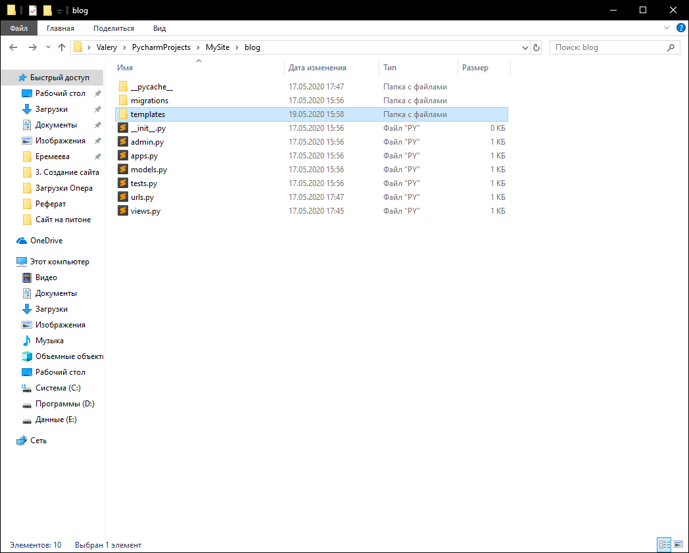

Теперь, в папке templates, нам нужно создать ещё одну папку, которая точно также называется, как и приложение, то есть в нашем случае – blog.

Почему именно так? Дело в том, что Django собирает все папки в единую папку templates. Сейчас у нас одно приложение – blog, но если бы у нас было бы ещё несколько приложений, то в папке templates был бы хаос из файлов. Несмотря на то, что у нас одно приложение, мы будем писать сайт с правилами хорошего тона в программировании.

Теперь в папке blog, создадим файлы home.html и contacts.html

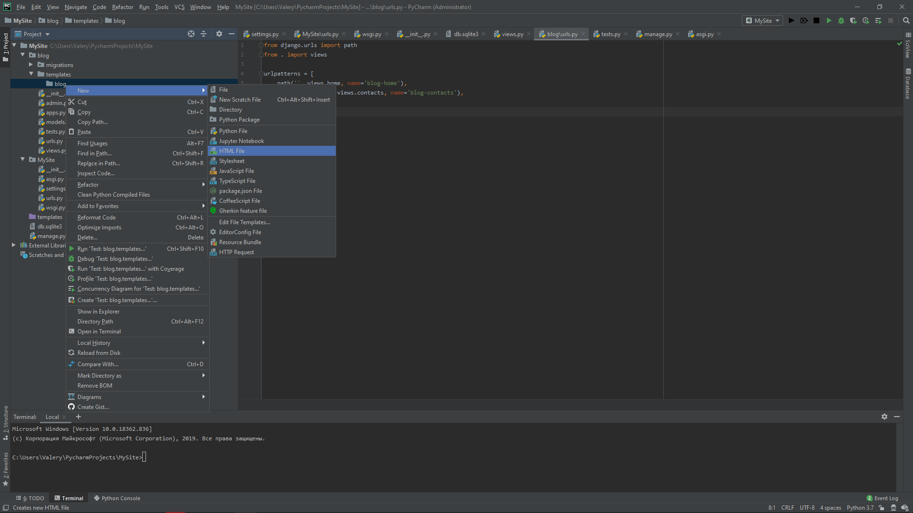

Как мы видим, файлы у нас не пусты.

```markup
<!DOCTYPE html>
<html lang="en">
    <head>
        <meta charset="UTF-8">
        <title>Title</title>
    </head>
    <body>

    </body>
</html>
```

Удалим всё лишнее.

Настроим PyCharm. Нам потребуется плагин для работы с html-файлами. Плагин называется – Emmet.

Переходим в IDE по следующей ветке: File -> Settings

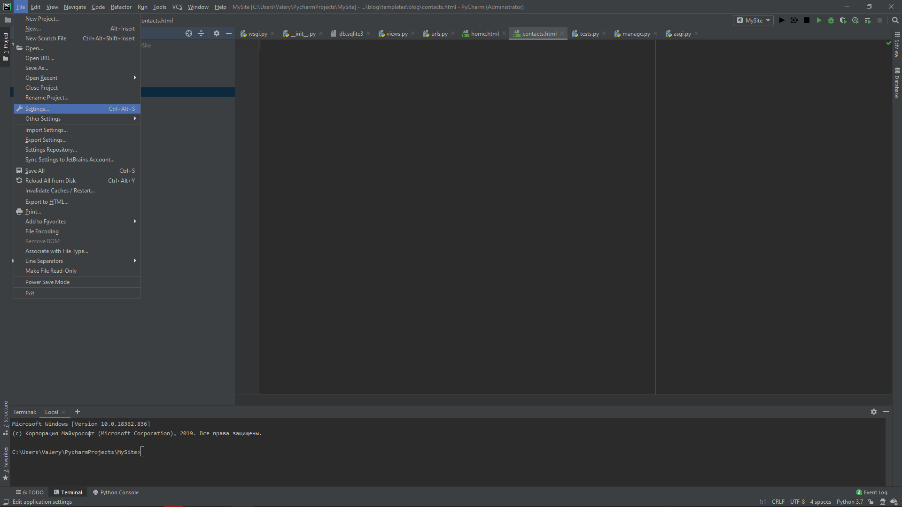

В панели поиска напишем название нашего плагина

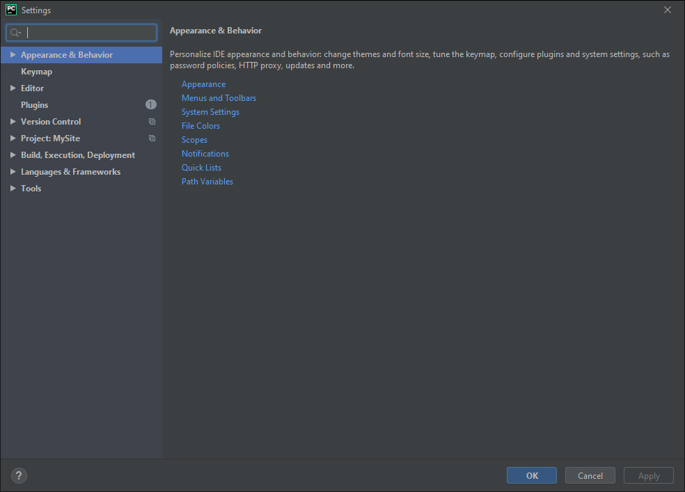

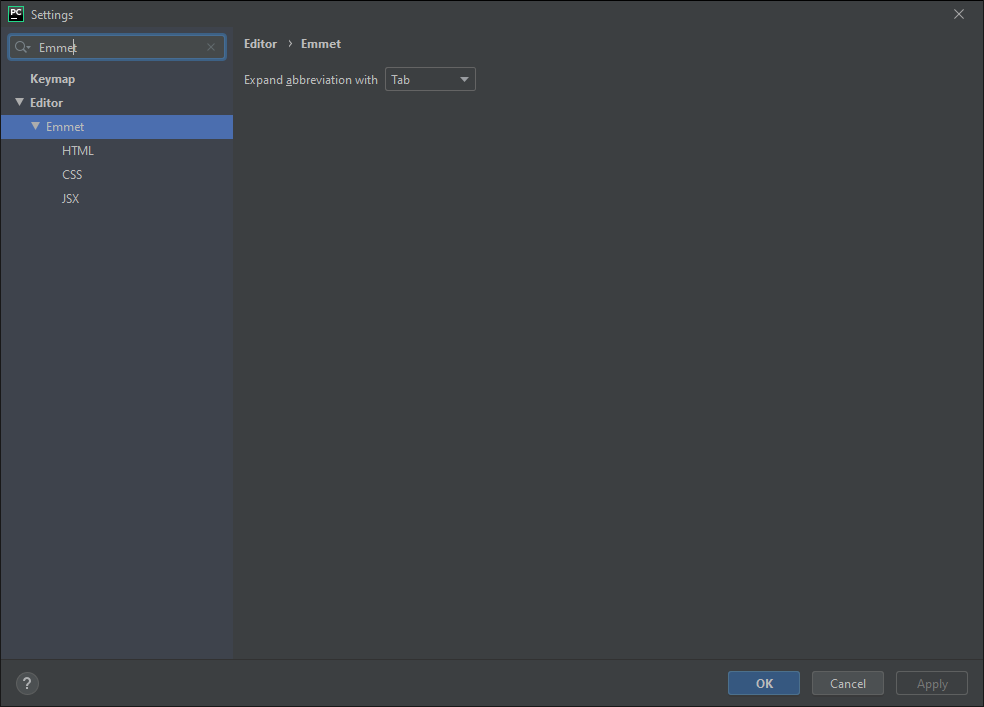

Обычно, он установлен по умолчанию и находится во вкладке Editor. Если его у вас нет, нажмите кнопку Install в появляющемся после запроса окне.

Как мы видим, плагин будет реагировать на кнопку “Tab”. Это нам и нужно. Нажимаем ОК и возвращаемся к файлам html.

Введите `!` и нажмите Tab.

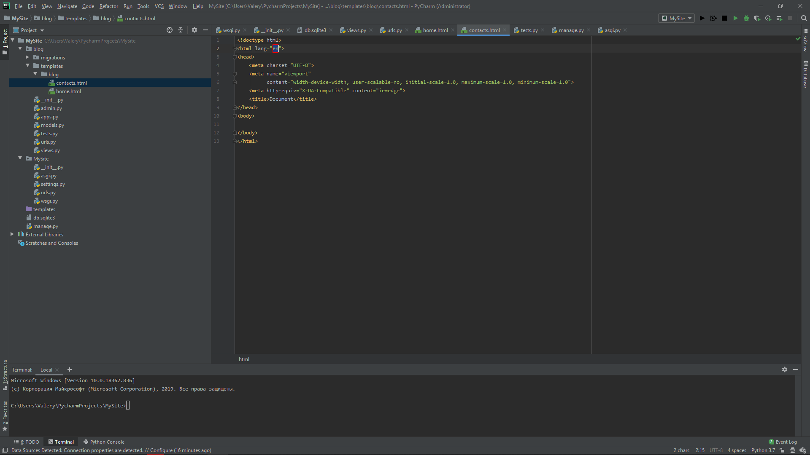

Не меняем ничего, кроме двух пунктов.

1. Удалим в поле `<title>` слово “Documents”
2. В теле введём заголовок `<h2>`

Результат (contacts.html):

```markup
<!doctype html>  
<html lang="en">
    <head>
        <meta charset="UTF-8">
        <meta name="viewport" content="width=device-width, user-scalable=no, initial-scale=1.0, maximum-scale=1.0, minimum-scale=1.0">
        <meta http-equiv="X-UA-Compatible" content="ie=edge">
        <title></title>
    </head>
    <body>
        <h2>Контакты работают иначе</h2>
    </body>
</html>
```

Теперь, чтобы шаблоны были доступны, необходимо в главном файле настройки проекта – settings.py в установленных приложениях (INSTALLED\_APPS) ввести наше приложение – blog.

Сделаем тоже самое для главной страницы.

Результат (home.html):

```markup
<!doctype html>  
<html lang="en">
    <head>
        <meta charset="UTF-8">
        <meta name="viewport" content="width=device-width, user-scalable=no, initial-scale=1.0, maximum-scale=1.0, minimum-scale=1.0">
        <meta http-equiv="X-UA-Compatible" content="ie=edge">
        <title></title>
    </head>
    <body>
        <h2>Ура! Главная страница поменялась</h2>
    </body>
</html>
```

Переходим к файлу настроек и вписываем туда строку:

`blog.apps.BlogConfig`

Таким образом, мы вводим приложение blog, сведения о котором хранятся в файле apps и обращаемся к функции BlogConfig.

Результат:

```python
INSTALLED_APPS = [
    'blog.apps.BlogConfig',
    'django.contrib.admin',
    'django.contrib.auth',
    'django.contrib.contenttypes',
    'django.contrib.sessions',
    'django.contrib.messages',
    'django.contrib.staticfiles',
]
```

Взглянем на файл apps.py в проекте сайта.

```python
from django.apps import AppConfig  


class BlogConfig(AppConfig):
    name = 'blog'
```

Остался последний шаг – настроить vievs.py. Сейчас там прописаны функции – HttpResponse, то есть ответы через http. Это неправильно. Сайт будет работать на html вёрстке и нам нужно не выдавать http ответы, а обращаться к html шаблонам. Исправляем:

```python
from django.shortcuts import render  
from django.http import HttpResponse  


def home(request):  
    return render(request, 'blog/home.html')  


def contacts(request):  
    return render(request, 'blog/contacts.html')
```

Обратите внимание на сигналы PyCharm:

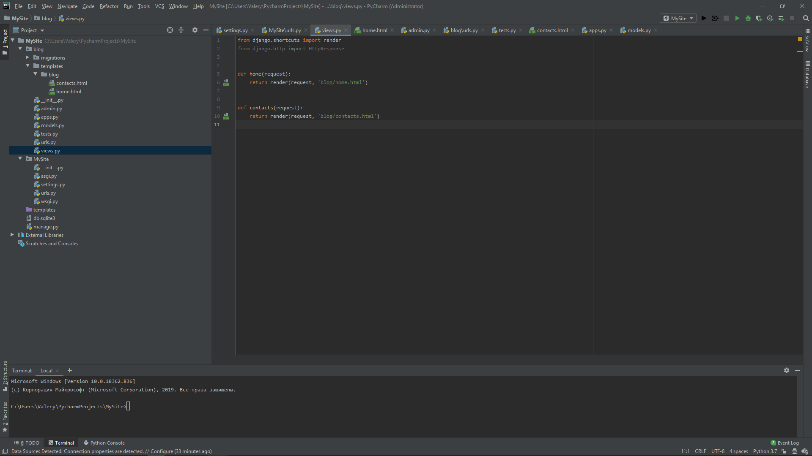

Строка с импортом библиотеки HttpResponse стала серой. Это знак того, что мы не использовали в фале программы эту библиотеку. Её можно удалить.

Помимо прочего, появилось зелёные ярлычки слева. Это знак, что мы обращаемся к нашему html-файлу. Если навести на него курсор, отобразиться имя файла, а если кликнуть по нему, мы перейдём в этот файл.

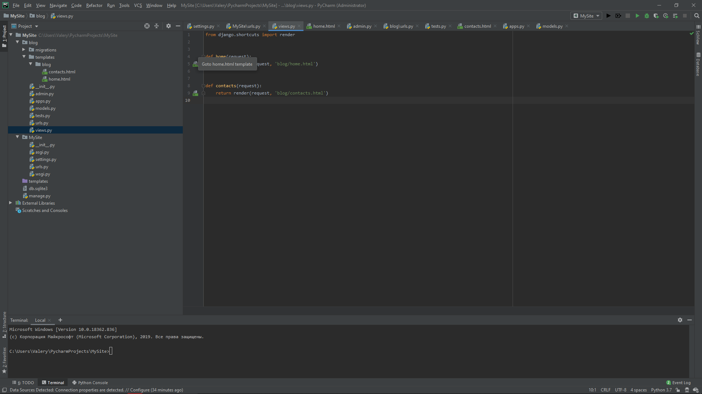

Запускаем сервер и проверяем как всё работает:

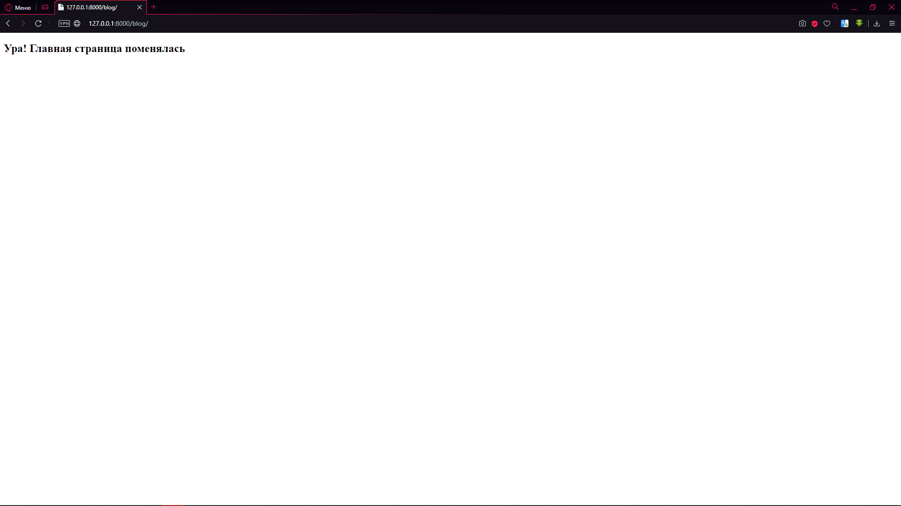

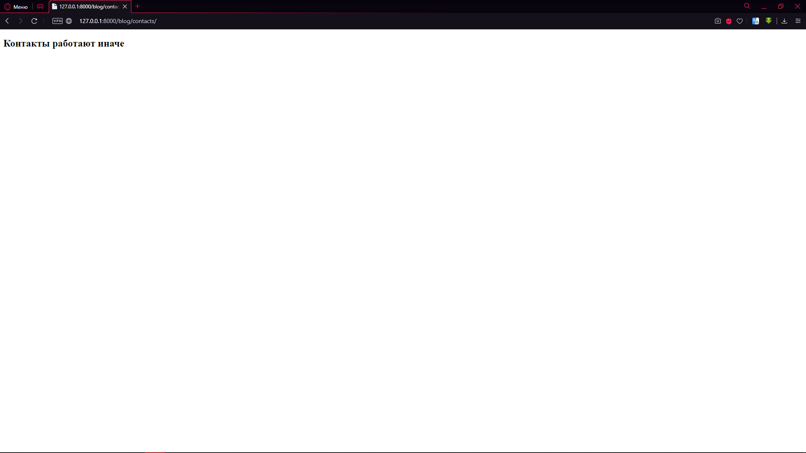

Всё работает как надо!

## Создаём html-страницы с динамическими данными

Теперь научимся передавать динамические данные. Это – заготовка под базы данных, которыми мы потом будем пользоваться.

Перейдём в файл views.py.

Написав немного кода, я изменил файл так:

```python
from django.shortcuts import render  

news = [
    {
        'title': 'Первая запись',  
        'text': 'Много-много текста',  
        'date': '10 Мая 2020',  
        'author': 'Валерий'  
    },  
    {  
        'title': 'Вторая запись',  
        'text': 'Снова много-много текста',  
        'date': '19 Мая 2020',  
        'author': 'Егор'  
    }  
]  


def home(request):  
    data = {  
        'news': news,  
        'title': 'Главная страница'  
    }  
    return render(request, 'blog/home.html', data)  


def contacts(request):  
    return render(request, 'blog/contacts.html')
```

Построчно разберём что к чему. Создан список news, состоящий из 2 записей. Каждая запись – это словарь. В каждом словаре по 4 элемента. В функции отрисовки главной страницы, я добавил переменную data, которая создаёт словарь news и вызывает в него созданный список новостей. Плюс к этому, в data мы вызывает ещё один объект – заголовок страницы (title). В самом же рендере, мы добавили переменную в конце и вызываем её.

Теперь перейдём в html-файл нашей главной страницы (home.html)

Снова написав немного кода, получаем следующее:

```markup
<!doctype html>  
<html lang="en">  
    <head>  
        <meta charset="UTF-8">  
        <meta name="viewport" content="width=device-width, user-scalable=no, initial-scale=1.0, maximum-scale=1.0, minimum-scale=1.0">
        <meta http-equiv="X-UA-Compatible" content="ie=edge">  
        <title>{{ title }}</title>  
    </head>
    <body>  
        
  
            <h1>{{ post.title }}</h1>  
            <p>{{ post.text }}</p>  
              
                <p>Автор: Админ</p>  
              
                <p>Автор: {{ post.author }}</p>  
              
            <p>Дата: {{ post.date }}</p>  
        
  
    </body>  
</html>
```

В поле \ мы вызываем нужную нам строку – «Главная страница». В теле мы используем 2 конструкции:

1. for
2. if

Так как, мы пишем вёрстку на Python в html-файле, конструкции используются при помощи такой конфигурации: ``

Если бы мы писали тот же код, но на чистом питоне, выглядел бы он так:

```python
for post in news:
    print('post.title')
    print('post.text')
    if post.author == 'Валерий':
        print('Автор: Админ')
    else:
        print('Автор: ', post.author)
    print('Дата: ', post.data)
```

Посмотрите основные отличия:

* Отсутствие двоеточий после for и if, но наличие конструкции endfor и endif
* Добавлена разметка html, то есть \<p>, \<h2> и т.п.
* Отсутствие кавычек и слова "print"

Запустим сервер и посмотрим на результат:

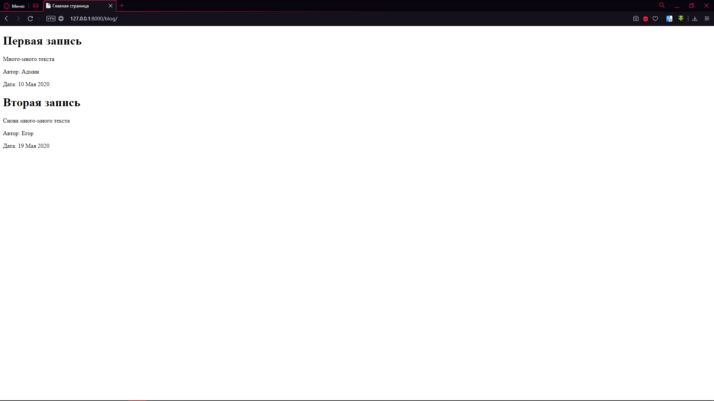

Подредактируем ещё немного файл views.py. Допустим, нам нужно вывести только заголовок (title), а остаток кода не менять и не выводить все новости (data). В таком случае, сделаем следующую конструкцию:

```python
def contacts(request):  
    return render(request, 'blog/contacts.html', {'title': 'Страничка про МИИГАиК'})
```

А в файл contacts.html выглядит теперь так:

```markup
<!doctype html>  
<html lang="en">  
    <head>  
        <meta charset="UTF-8">  
        <meta name="viewport" content="width=device-width, user-scalable=no, initial-scale=1.0, maximum-scale=1.0, minimum-scale=1.0">
        <meta http-equiv="X-UA-Compatible" content="ie=edge">  
        <title>{{ title }}</title>  
    </head>
    <body>
        <h2>Контакты работают иначе</h2>
    </body>  
</html>
```

Проверяем:

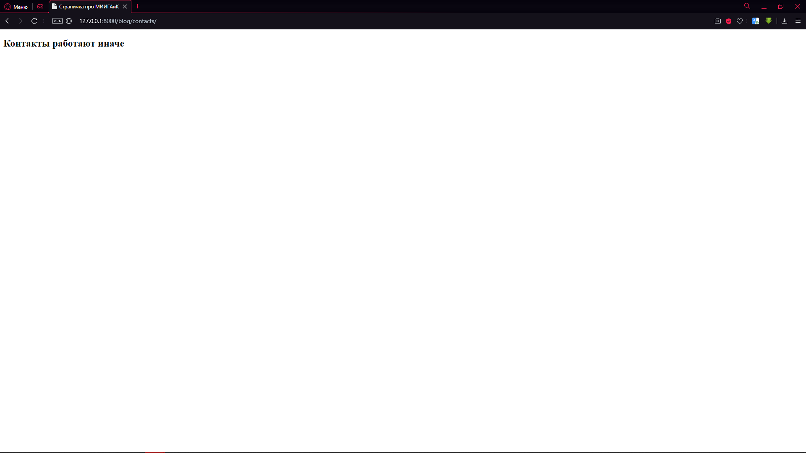

Теперь давайте сравним 2 файла home.html и contacts.html. Что в них отличается?

Единственный блок, который у них отличается – тело, а «шапка» (верхняя часть сайта) и «подвал» (нижняя часть сайта) остаются одинаковыми. Конечно, нам не будет интересно переписывать один и тот же код на каждой странице. Давайте исправим это неудобство.

Создадим рядом с файлами home.html и contacts.html файл main.html и пишем в него следующий код:

```markup
<!doctype html>  
<html lang="en">  
    <head>  
        <meta charset="UTF-8">  
        <meta name="viewport" content="width=device-width, user-scalable=no, initial-scale=1.0, maximum-scale=1.0, minimum-scale=1.0">
        <meta http-equiv="X-UA-Compatible" content="ie=edge">  
        <title>{{ title }}</title>  
    </head>
    <body>  
        
  
        
  
    </body>  
</html>
```

То есть, мы можем скопировать весь код с любого из html-файла и в теле сайта записать блочную конструкцию:

```markup

  


```

Перейдём в файл contacts.html и перепишем его таким образом:

```markup

  
  
    <h2>Контакты работают иначе</h2>  


```

То есть, мы обращаемся к файлу blog/main.html и из него берём всё, что было до блока, пишем блок (тело страницы) и забираем всё, что нужно после. Повторяем операцию с файлом home.html.

```markup

  
  
      
        <h1>{{ post.title }}</h1>  
        <p>{{ post.text }}</p>  
          
            <p>Автор: Админ</p>  
          
            <p>Автор: {{ post.author }}</p>  
          
    <p>Дата: {{ post.date }}</p>  
      


```

Проверяем и видим тоже самое. Давайте теперь напишем какую-нибудь глобальную фразу в main.html. Например, так:

```markup
<!doctype html>  
<html lang="en">  
    <head>  
        <meta charset="UTF-8">  
        <meta name="viewport" content="width=device-width, user-scalable=no, initial-scale=1.0, maximum-scale=1.0, minimum-scale=1.0">
        <meta http-equiv="X-UA-Compatible" content="ie=edge">  
        <title>{{ title }}</title>  
    </head>
    <body>  
        <h1>МИИГАиК - лучший ВУЗ!</h1>
        
  
        
  
    </body>  
</html>
```

Проверим что получилось:

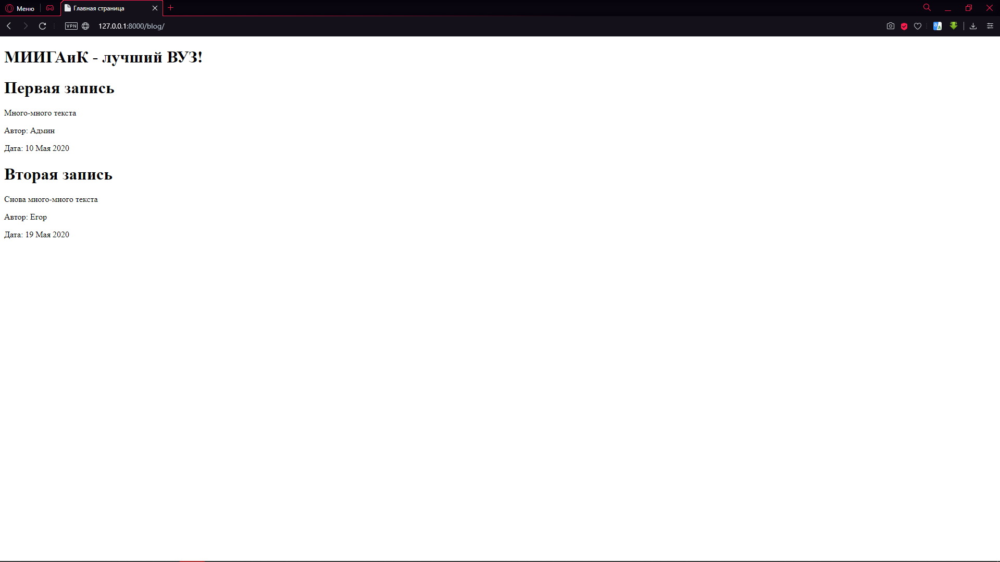

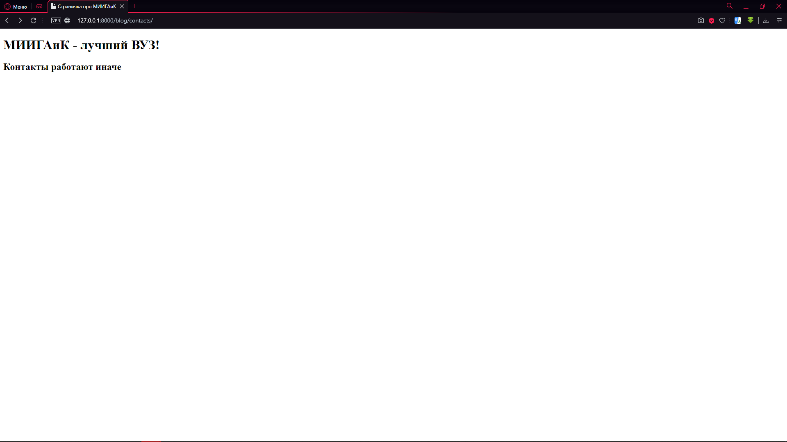

Теперь эта фраза нас преследует везде и на каждой странице. Сейчас это изменение можно убрать, так как нам ещё предстоит много работы со станицами.
