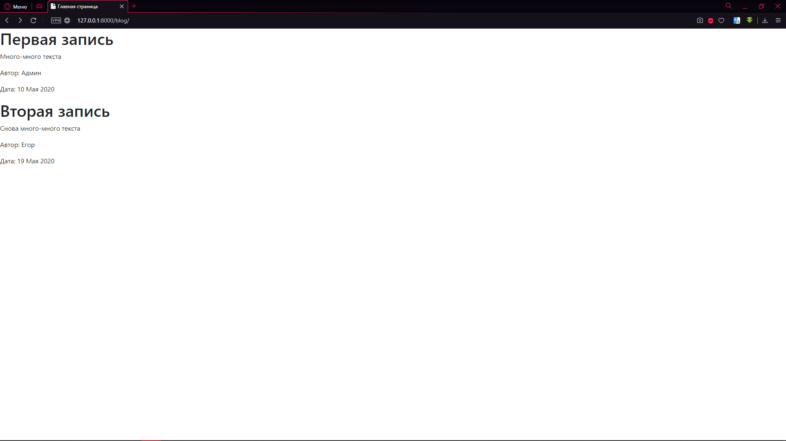
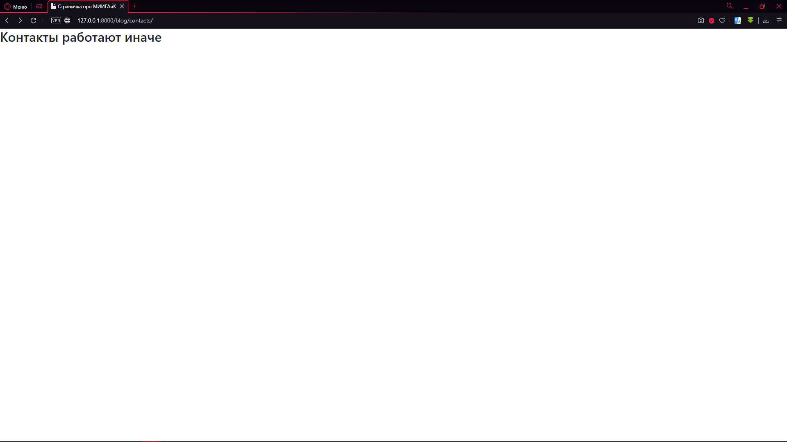
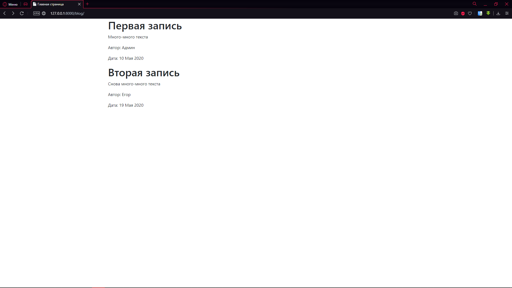
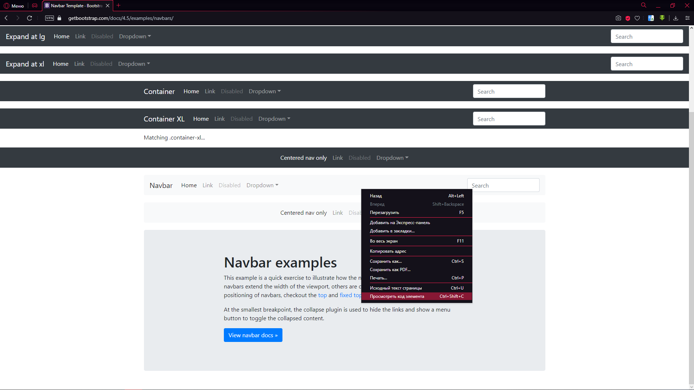
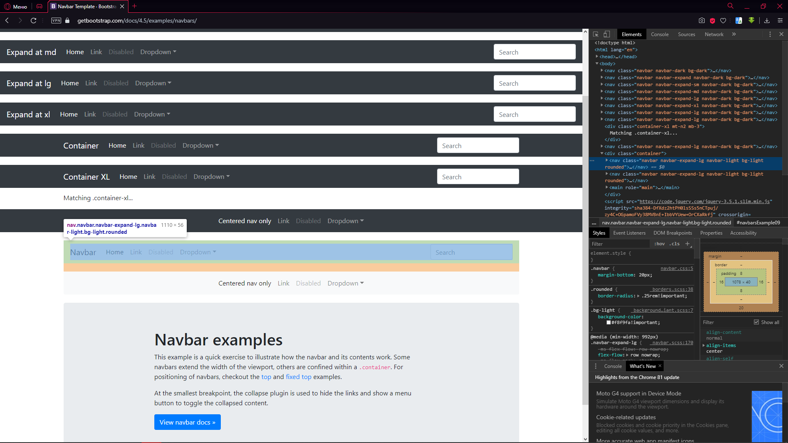
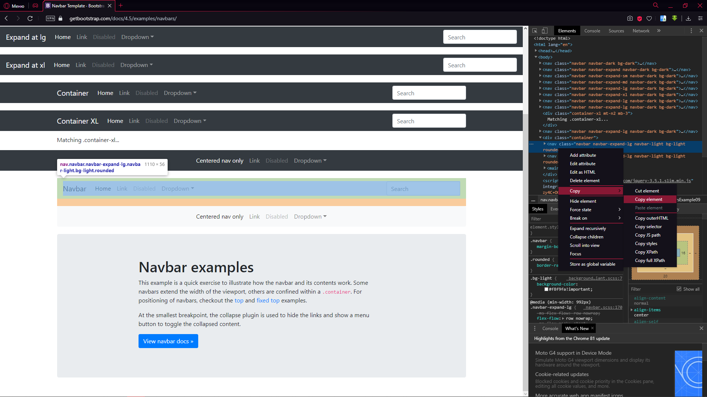
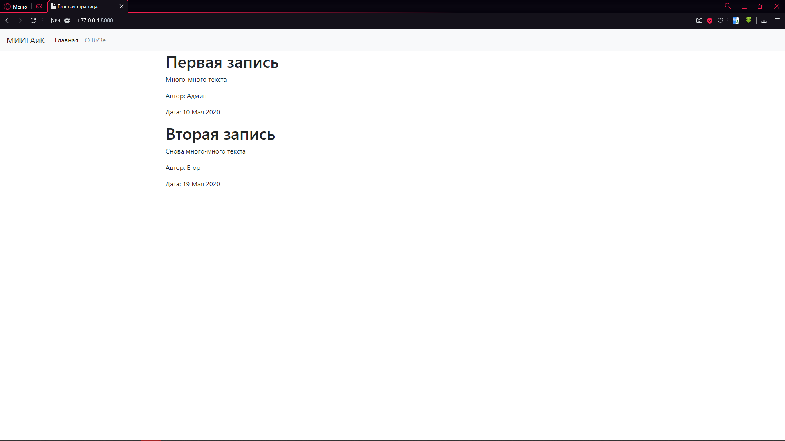
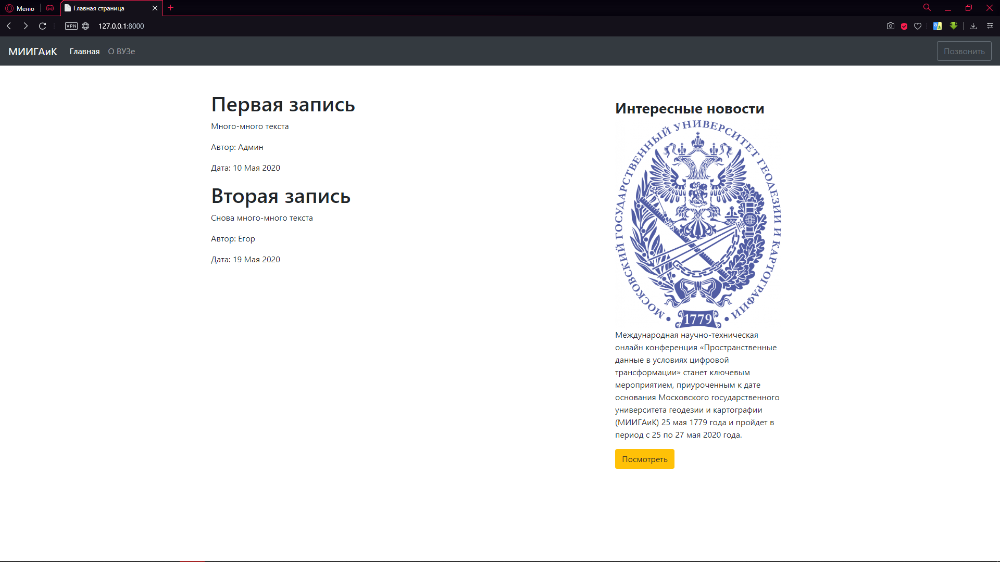
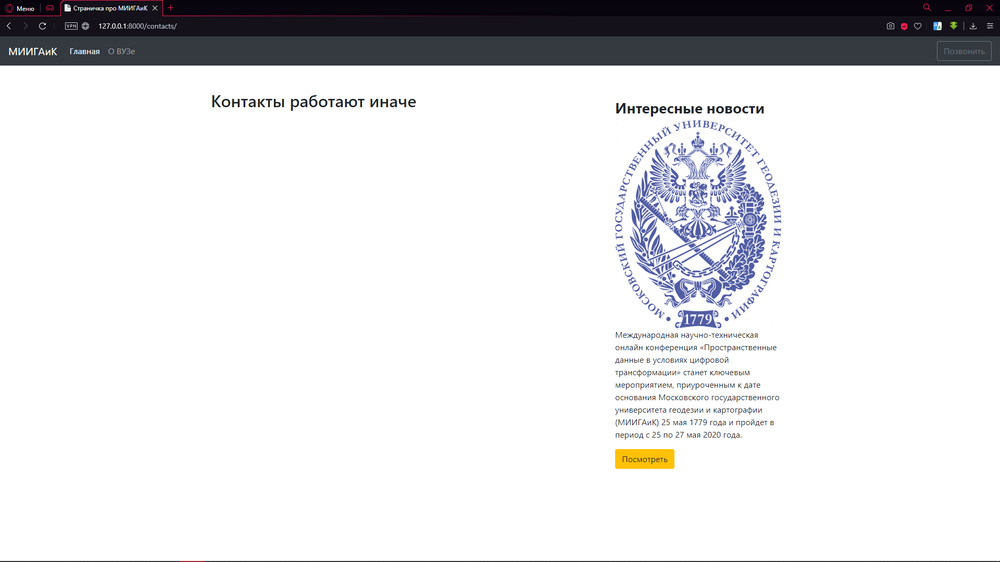

# Часть пятая. Шаблонизатор

**Цель:** Создание полноценного сайта с использованием шаблонизатора

**Задачи:**

* Установка Bootstrap
* Применение шаблонов Bootstrap
* Графическая настройка страницы
* Создание статических стилей

## Bootstrap

Перейдём к последнему блоку – фреймворку Bootstrap.

Bootstrap – это фреймворк, в котором прописаны ряд CSS стилей и JavaScript скриптов. Их можно использовать, прописывая их у нас в проекте.

Переходим на сайт ниже:



Копируем первую строку кода:

[`https://stackpath.bootstrapcdn.com/bootstrap/4.5.0/css/bootstrap.min.css`](https://stackpath.bootstrapcdn.com/bootstrap/4.5.0/css/bootstrap.min.css)

Переходим в main.html и до закрытия «головы» сайта (head) прописывает link, нажимаем Tab и вставляем скопированную ссылку. Должно получиться вот так:

```markup
<!doctype html>
<html lang="en">
    <head>
        <meta charset="UTF-8">
        <meta name="viewport" content="width=device-width, user-scalable=no, initial-scale=1.0, maximum-scale=1.0, minimum-scale=1.0">
        <meta http-equiv="X-UA-Compatible" content="ie=edge">
        <title>{{ title }}</title>
        <link rel="stylesheet" ref="https://stackpath.bootstrapcdn.com/bootstrap/4.5.0/css/bootstrap.min.css">
    </head>
    <body>
        

        

    </body>
</html>
```

Сейчас мы подключили CSS стиль к нашему сайту. Посмотрим на результат:





Не сказать, что сайт стал красивым, но он уже начал своё преображение. Продолжим.

Пишем в теле main.html «main.container» и жмём Tab (спасибо, Emmet). Должно получиться так:

```markup
<!doctype html>
<html lang="en">
    <head>
        <meta charset="UTF-8">
        <meta name="viewport" content="width=device-width, user-scalable=no, initial-scale=1.0, maximum-scale=1.0, minimum-scale=1.0">
        <meta http-equiv="X-UA-Compatible" content="ie=edge">
        <title>{{ title }}</title>
        <link rel="stylesheet" ref="https://stackpath.bootstrapcdn.com/bootstrap/4.5.0/css/bootstrap.min.css">
    </head>
    <body>
        <main class="container">
            

            

        </main>
    </body>
</html>
```

Результат:



Теперь, добавим шапку. Для этого переходим на сайт [https://getbootstrap.com](https://getbootstrap.com). На нём, переходим во вкладку Examples, затем – Navbars.

Выбираем понравившуюся панель. Кликаем по ней правой кнопкой мыши -> Показать код элемента





В коде выделяем элемент целиков, как показано на скриншоте и нажимаем кнопку Copy Element



Скопированный элемент вставляем в тело в файле main.html. Вот так:

```markup
<!doctype html>
<html lang="en">
    <head>
        <meta charset="UTF-8">
        <meta name="viewport" content="width=device-width, user-scalable=no, initial-scale=1.0, maximum-scale=1.0, minimum-scale=1.0">
        <meta http-equiv="X-UA-Compatible" content="ie=edge">
        <title>{{ title }}</title>
        <link rel="stylesheet" ref="https://stackpath.bootstrapcdn.com/bootstrap/4.5.0/css/bootstrap.min.css">
    </head>
    <body>
        <nav class="navbar navbar-expand-lg navbar-light bg-light rounded">
            <a class="navbar-brand" href="#">Navbar</a>
            <button class="navbar-toggler" type="button" data-toggle="collapse" data-arget="#navbarsExample09" aria-controls="navbarsExample09" aria-expanded="false" aria-label="Toggle navigation">
                <span class="navbar-toggler-icon"></span>
            </button>

            <div class="collapse navbar-collapse" id="navbarsExample09">
                <ul class="navbar-nav mr-auto">
                    <li class="nav-item active">
                        <a class="nav-link" href="#">Home <span class="sr-only">(current)</span></a>
                    </li>
                    <li class="nav-item">
                        <a class="nav-link" href="#">Link</a>
                    </li>
                    <li class="nav-item">
                        <a class="nav-link disabled" href="#" tabindex="-1" aria-disabled="true">Disabled</a>
                    </li>
                    <li class="nav-item dropdown">
                        <a class="nav-link dropdown-toggle" href="#" id="dropdown09" data-toggle="dropdown" aria-haspopup="true" aria-expanded="false">Dropdown</a>
                        <div class="dropdown-menu" aria-labelledby="dropdown09">
                            <a class="dropdown-item" href="#">Action</a>
                            <a class="dropdown-item" href="#">Another action</a>
                            <a class="dropdown-item" href="#">Something else here</a>
                        </div>
                    </li>
                </ul>
                <form class="form-inline my-2 my-md-0">
                    <input class="form-control" type="text" placeholder="Search" aria-label="Search">
                </form>
            </div>
        </nav>
        <main class="container">
            

            

        </main>
    </body>
</html>
```

Осталось отредактировать шаблон. Так и сделаем:

```markup
<!doctype html>
<html lang="en">
    <head>
        <meta charset="UTF-8">
        <meta name="viewport" content="width=device-width, user-scalable=no, initial-scale=1.0, maximum-scale=1.0, minimum-scale=1.0">
        <meta http-equiv="X-UA-Compatible" content="ie=edge">
        <title>{{ title }}</title>
        <link rel="stylesheet" ref="https://stackpath.bootstrapcdn.com/bootstrap/4.5.0/css/bootstrap.min.css">
    </head>
    <body>
        <nav class="navbar navbar-expand-lg navbar-light bg-light rounded">
            <a class="navbar-brand" href="/blog/">МИИГАиК</a>
            <button class="navbar-toggler" type="button" data-toggle="collapse" data-arget="#navbarsExample09" aria-controls="navbarsExample09" aria-expanded="false" aria-label="Toggle navigation">
                <span class="navbar-toggler-icon"></span>
            </button>

            <div class="collapse navbar-collapse" id="navbarsExample09">
                <ul class="navbar-nav mr-auto">
                    <li class="nav-item active">
                        <a class="nav-link" href="/blog/">Главная</a>
                    </li>
                    <li class="nav-item">
                        <a class="nav-link" href="/blog/contacts">О ВУЗе</a>
                    </li>
                </ul>
            </div>
        </nav>
        <main class="container">
            

            

        </main>
    </body>
</html>
```

Результат:


На этом моменте, становиться видна одна проблема: ссылка на главную страницу выглядит так:

`<a class="navbar-brand" href="/blog/">МИИГАиК</a>`, то есть главной страницы у нас нет. Мы переходим на страницу второго уровня – blog. Исправим это. Переходим в urls.py в папке проекта (MySite). В файле меняем одно поле.

С этого:

```python
path('/blog', include('blog.urls')),
```

на это:

```python
path('', include('blog.urls')),
```

Затем поменяем ссылки в main.html с:

```markup
<a class="navbar-brand" href="/blog/">МИИГАиК</a>
```

на:

```markup
<a class="navbar-brand" href="/">МИИГАиК</a>
```

Финальный код выглядит так:

```markup
<!doctype html>
<html lang="en">
    <head>
        <meta charset="UTF-8">
        <meta name="viewport" content="width=device-width, user-scalable=no, initial-scale=1.0, maximum-scale=1.0, minimum-scale=1.0">
        <meta http-equiv="X-UA-Compatible" content="ie=edge">
        <title>{{ title }}</title>
        <link rel="stylesheet" ref="https://stackpath.bootstrapcdn.com/bootstrap/4.5.0/css/bootstrap.min.css">
    </head>
    <body>
        <nav class="navbar navbar-expand-lg navbar-light bg-light rounded">
            <a class="navbar-brand" href="/">МИИГАиК</a>
            <button class="navbar-toggler" type="button" data-toggle="collapse" data-arget="#navbarsExample09" aria-controls="navbarsExample09" aria-expanded="false" aria-label="Toggle navigation">
                <span class="navbar-toggler-icon"></span>
            </button>

            <div class="collapse navbar-collapse" id="navbarsExample09">
                <ul class="navbar-nav mr-auto">
                    <li class="nav-item active">
                        <a class="nav-link" href="/">Главная</a>
                    </li>
                    <li class="nav-item">
                        <a class="nav-link" href="/contacts">О ВУЗе</a>
                    </li>
                </ul>
            </div>
        </nav>
        <main class="container">
            

            

        </main>
    </body>
</html>
```

Проверяем адрес главной страницы:



Всё в порядке.

## Редактируем стиль в Bootstrap

Теперь вы можете самостоятельно отредактировать сайт с пояснениями из Bootstrap – [https://getbootstrap.com/docs](https://getbootstrap.com/docs). Помните один важный момент – Bootstrap разделяет страницу по вертикали на 12 колонн равной величины, а по горизонтали – разделений нет.

Я настроил сайт по своему вкусу и вот, что у меня получилось (работаем только с файлом main.html):

```markup
<!doctype html>
<html lang="en">
    <head>
        <meta charset="UTF-8">
        <meta name="viewport" content="width=device-width, user-scalable=no, initial-scale=1.0, maximum-scale=1.0, minimum-scale=1.0">
        <meta http-equiv="X-UA-Compatible" content="ie=edge">
        <title>{{ title }}</title>
        <link rel="stylesheet" ref="https://stackpath.bootstrapcdn.com/bootstrap/4.5.0/css/bootstrap.min.css">
    </head>
    <body>
        <nav class="navbar navbar-expand-lg navbar-dark bg-dark mb-5">
            <a class="navbar-brand" href="/">МИИГАиК</a>
            <button class="navbar-toggler" type="button" data-toggle="collapse" data-
arget="#navbarsExample09" aria-controls="navbarsExample09" aria-expanded="false" aria-label="Toggle navigation">
                <span class="navbar-toggler-icon"></span>
            </button>

            <div class="collapse navbar-collapse" id="navbarsExample09">
                <ul class="navbar-nav mr-auto">
                    <li class="nav-item active">
                        <a class="nav-link" href="/">Главная</a>
                    </li>
                    <li class="nav-item">
                        <a class="nav-link" href="/contacts">О ВУЗе</a>
                    </li>
                </ul>
            </div>
            <div class="navbar-nav">
                <a href="tel:+74993227800" class="btn btn-outline-secondary">Позвонить</a>
            </div>
        </nav>
        <main class="container">
            <div class="row">
                <div class="col-md-8">
                    

                    

                </div>

                <aside class="col-md-4">
                    <div class="p-3">
                        <h3><b>Интересные новости</b></h3>
                        
                        <p>Международная научно-техническая онлайн конференция «Пространственные данные в условиях цифровой трансформации» станет ключевым мероприятием, приуроченным к дате основания Московского государственного университета геодезии и картографии (МИИГАиК) 25 мая 1779 года и пройдет в период с 25 по 27 мая 2020 года.</p>
                        <a href="http://www.miigaik.ru/about/" target="_blank">
                            <button class="btn btn-warning">Посмотреть</button>
                        </a>
                    </div>
                </aside>
            </div>
        </main>
    </body>
</html>
```

Результат:





Внимательно изучите код и прочитайте о не понятных тегах в самоучителе по html и bootstrap.
