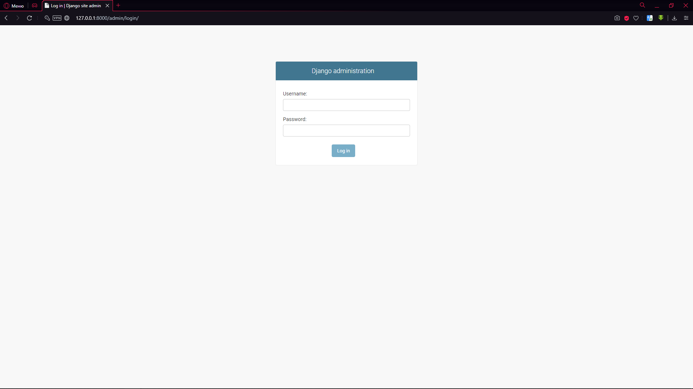
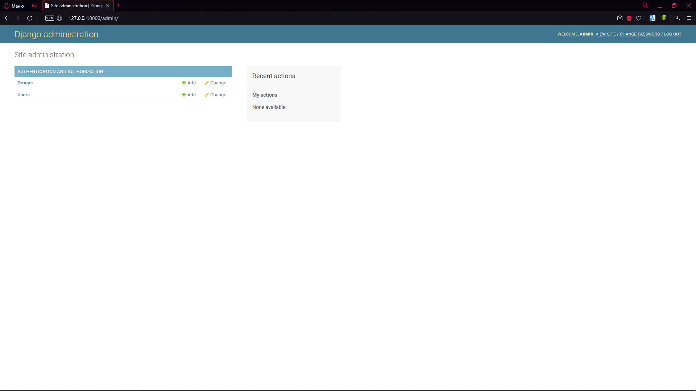
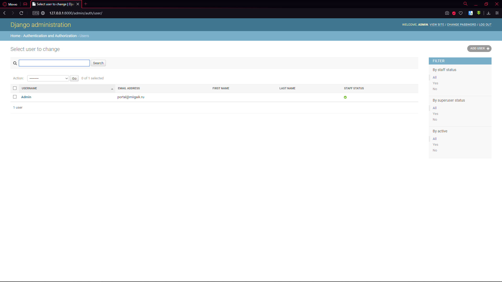
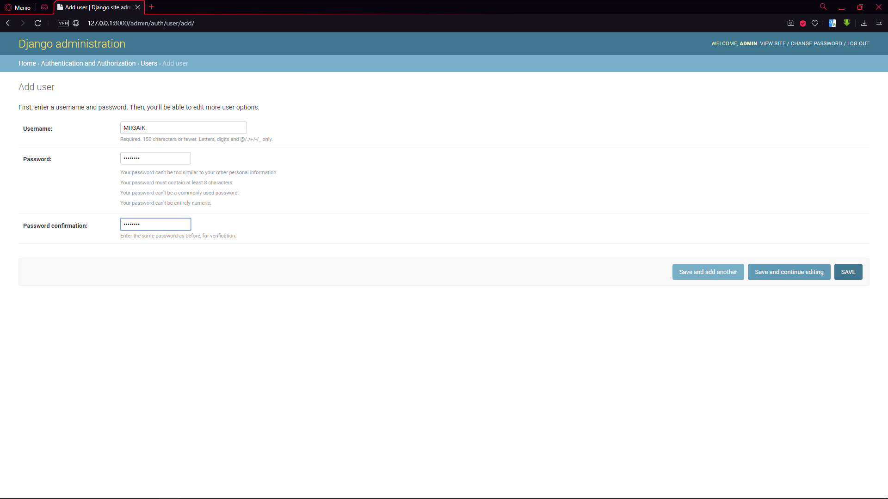
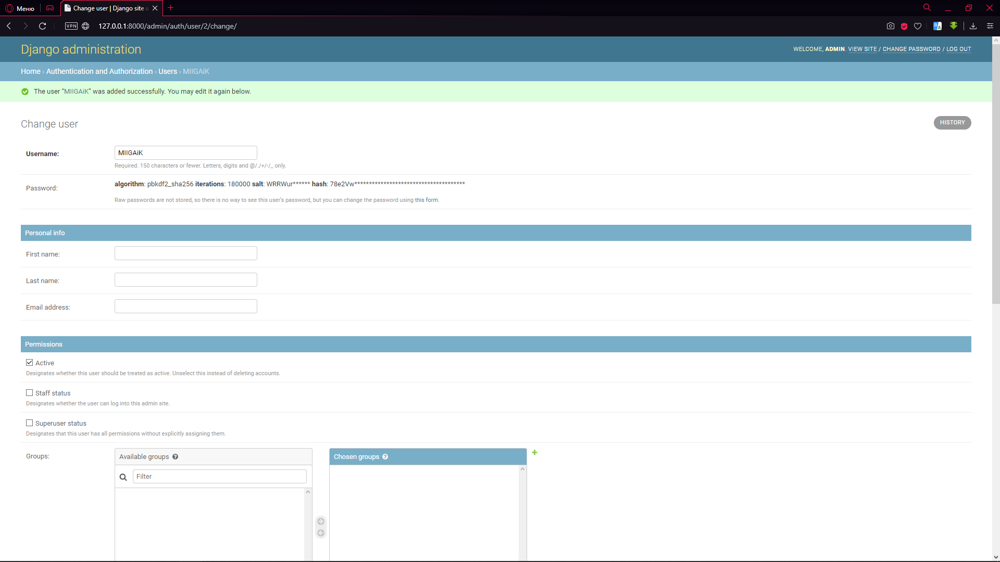

# Часть седьмая. Настройка панели администратора

**Цель:** Настроить панель администратора

**Задачи:**

* Настройка миграции данных
* Создание учётной записи администратора
* Работа под учётной записью администратора

## Миграция данных и создание суперпользователя

Перейдём в терминал и напишем команды:

```
python manage.py makemigrations
python manage.py migrate
python manage.py createsuperuser
```

Какие были диалоги:

```
C:\Users\Valery\PycharmProjects\MySite>python manage.py makemigrations
No changes detected

C:\Users\Valery\PycharmProjects\MySite>python manage.py migrate
Operations to perform:
Apply all migrations: admin, auth, contenttypes, sessions
Running migrations:
Applying contenttypes.0001_initial... OK
Applying auth.0001_initial... OK
Applying admin.0001_initial... OK
Applying admin.0002_logentry_remove_auto_add... OK
Applying admin.0003_logentry_add_action_flag_choices... OK
Applying contenttypes.0002_remove_content_type_name... OK
Applying auth.0002_alter_permission_name_max_length... OK
Applying auth.0003_alter_user_email_max_length... OK
Applying auth.0004_alter_user_username_opts... OK
Applying auth.0005_alter_user_last_login_null... OK
Applying auth.0006_require_contenttypes_0002... OK
Applying auth.0007_alter_validators_add_error_messages... OK
Applying auth.0008_alter_user_username_max_length... OK
Applying auth.0009_alter_user_last_name_max_length... OK
Applying auth.0010_alter_group_name_max_length... OK
Applying auth.0011_update_proxy_permissions... OK
Applying sessions.0001_initial... OK

C:\Users\Valery\PycharmProjects\MySite>python manage.py createsuperuser
Username (leave blank to use 'valery'): Admin
Email address: portal\@miigaik.ru
Password:
Password (again):
The password is too similar to the email address.
This password is too short. It must contain at least 8 characters.
Bypass password validation and create user anyway? [y/N]: y
Superuser created successfully.
```

Что мы сделали? Команда `makemigrations` выполнила подготовку к миграции базу данных (точнее, все баз данных). Наша база данных создалась автоматически при первом запуске сервера и файл с ней – db.sqlite3. Мы его подготовили к миграции, то есть к переходу в рабочую стезю сайта.

Вторая команда – `python manage.py migrate` выполнила ту самую миграцию.

Последняя команда – `python manage.py createsuperuser` создала суперпользователя (администратора). Мы ввели имя – Admin, почту – [portal@miigaik.ru](mailto:portal@miigaik.ru) и пароль – miigaik.

Попробуем зайти. Для этого – запустите сервер.

Вводим адрес – [http://127.0.0.1:8000/admin](http://127.0.0.1:8000/admin)



Вводим данные



Мы зашли как администратор.

## Работа от имени администратора

Что мы можем сделать в панели администратора? Сверху справа мы видим кнопки – «посмотреть сайт», «сменить пароль» и «выйти». Все кнопки работают по назначению.

Мы можем создать группу или пользователя. Перейдём к пользователям

Мы видим, что сейчас создан только один пользователь – Admin



Давайте создадим ещё одного. Жмём кнопку “Add user” сверху справа.



Введём имя пользователи и пароль и нажмём кнопку «Save and continue editing». Я ввёл имя – MIIGAiK и пароль Geodez240.



Мы видим, что наш пароль зашифрован и закэширован. Также, мы можем сделать мелкую настройку – ввести личные данные, добавить пользователя в группу, отметить дату и время регистрации и т.д. Сейчас – это полностью функционирующая панель администратора, но без настроенной базы данный.
