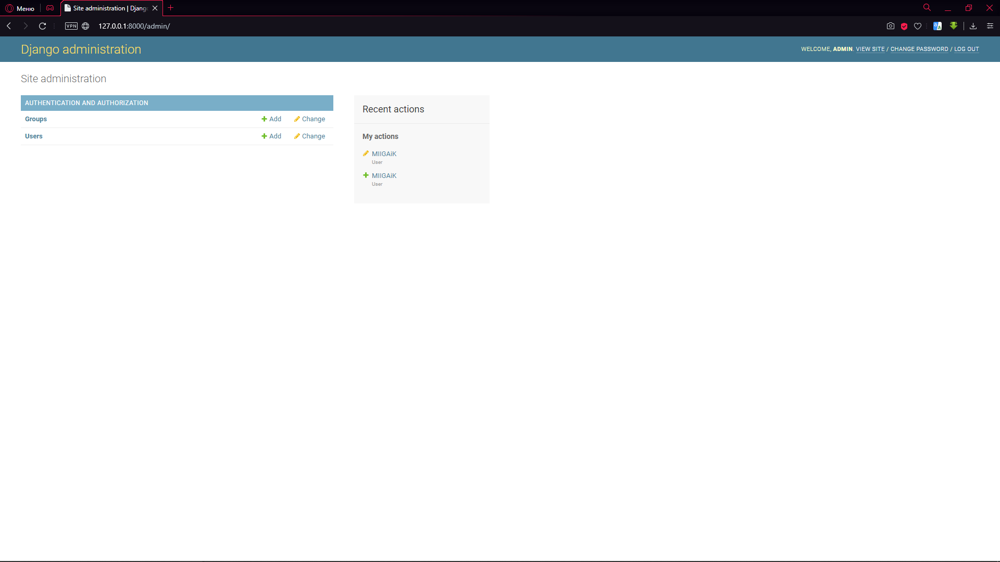
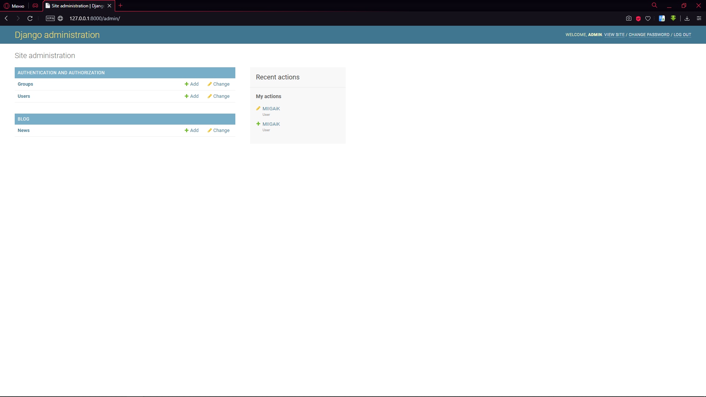
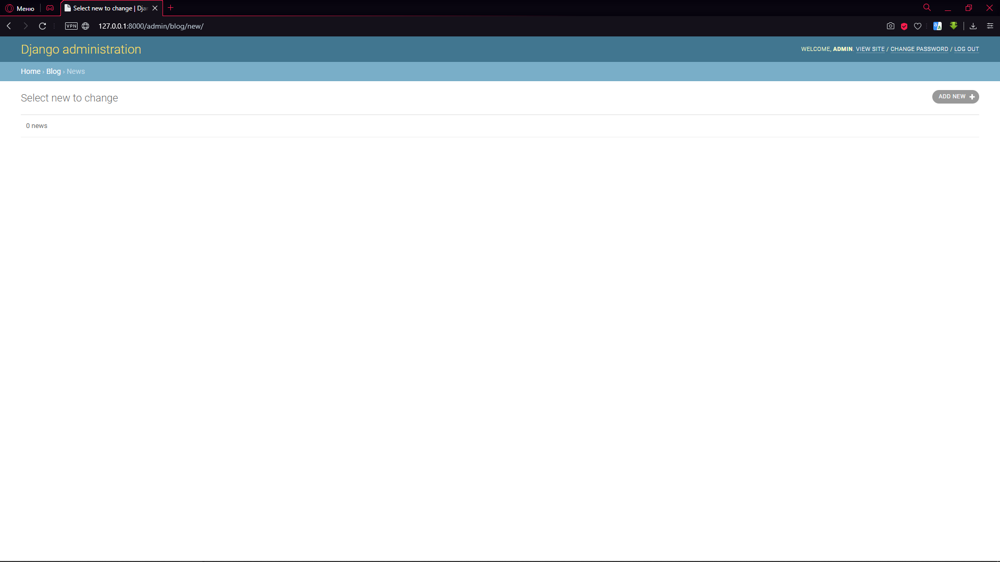
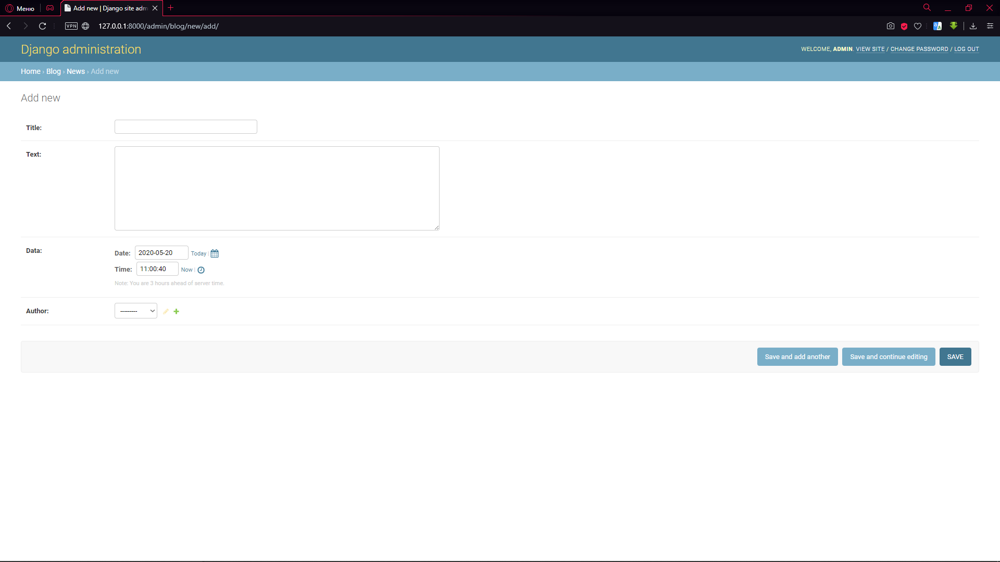
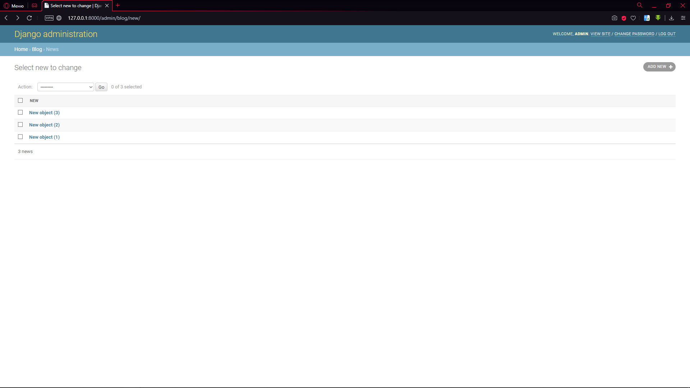
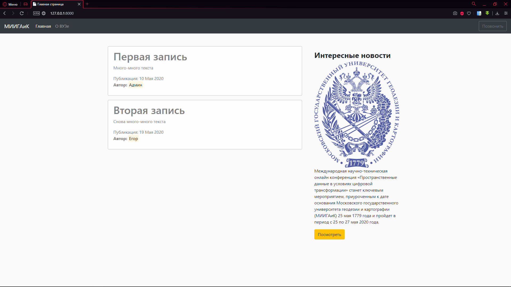
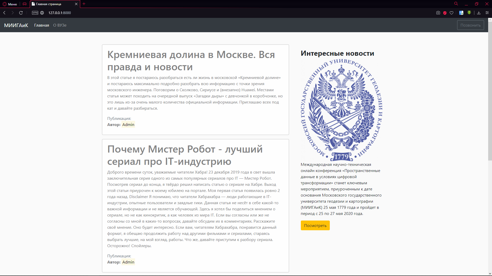
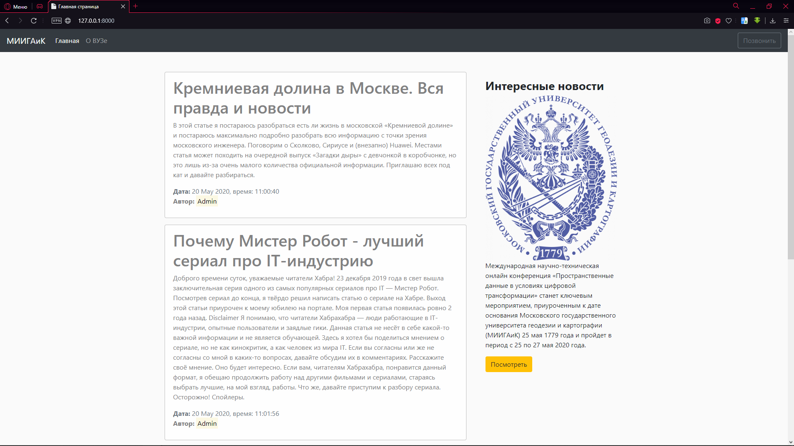
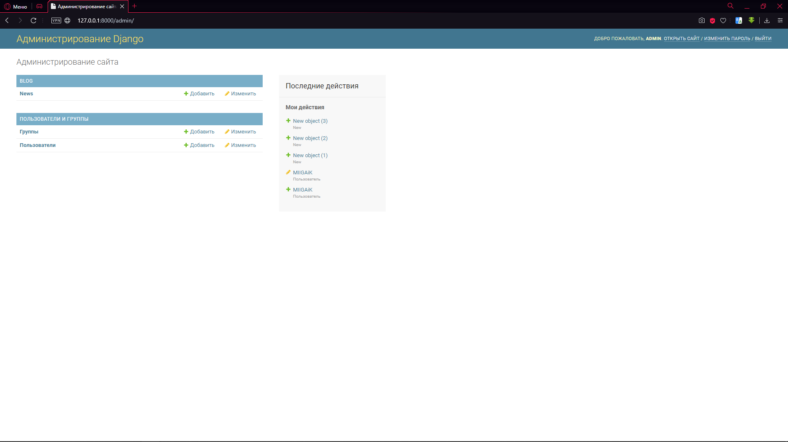

# Часть восьмая. Настройка базы данных

**Цель:** Создать и настроить базы данных

**Задачи:**

* Создание файла сборки базы данных
* Создание базы данных
* Миграция баз данных
* Отображение баз данных в динамическом режиме

## Создание шаблона сборки базы данных

Статьи, которые выведены на сайте созданы при помощи ручного кодирования. Нам необходимо сделать так, чтобы статья формировалась сама из базы данных, которую сейчас мы создадим и настроим.

Откроем файл models.py. Мы делаем базу данных только для приложения blog, а это значит, что и работать будем из директории приложения.

Сейчас этот файл выглядит так:

```python
from django.db import models  

# Create your models here.
```

Напишем небольшой код:

```python
from django.db import models
from django.utils import timezone
from django.contrib.auth.models import User


class New(models.Model):
    title = models.CharField(max_length=100)
    text = models.TextField()
    data = models.DateTimeField(default=timezone.now)
    author = models.ForeignKey(User, on_delete=models.CASCADE)
```

Построчно разберёмся в коде. Первая строка – импорт модели базы данных мы не меняем. Вторая строка и вторая библиотека, которая нам понадобится – `timezon`. Мы будем делать вывод текущих даты и времени после написания статьи. Последняя библиотека, которая нам нужна – `User`. Она нужна для того, чтобы из таблички пользователей взять авторов и поместить её в новую таблицу. С библиотеками закончили. Теперь – сам класс New.

Таблица, которую мы можем увидеть в панели администратора (см. предыдущий урок) – это класс со значениями. Нам нужно сделать таблицу с четырьмя столбцами – заголовок статьи (`title`), текст статьи (`text`), дата публикации (`data`) и автор статьи (`author`). Автором может быть только тот пользователь, который есть в таблице `Users`.

Каждый столбец принимает отдельный тип данных. В столбце `title` мы будем принимать текст, максимальная длина которого – 100 символов (`models.CharField(max_length=100)`). То есть, мы обращаемся к библиотеке `models`, из неё берём объект `CharField` (ввод строки) и выставляем это поле на максимальную длину на 100 символов (`max_length=100`). В столбце `text` мы берём текстовое поле без ограничений в размере. Текст – html-текст. В `data` мы поместим дату публикации. Для этого мы вводим поле даты (`DateTimeField`) и выставляем значением по умолчанию текущую дату и время в часовой зоне пользователя (Django способен определять зону по IP-адресу и синхронизировать время с зоной). Последний столбец – автор публикации (`author`). Так как, пользователи уже созданы и находятся в таблице `Users`, нам не требуется заново их вводить, а нужно лишь обратиться за ключом (в каждой таблице элемент называется ключом) и вывести его. Для этого обратимся к `ForeignKey`. Запросим таблицу с данными – `User`. Если же пользователь с сайта будет удалён, мы можем вывести вместо его имени что-то (например, фразу "User deleted") или же мы можем удалить эту запись совсем. Я выбрал удаление записи, так как оно сложнее в написании и будет этот метод выглядеть так: `on_delete=models.CASCADE`. Если же на нужно оставить запись и вывести фразу, то делается это так: `on_delete='User deleted'`. Как вы видите, ничего сложного.

Теперь выполним миграцию. Введём знакомую команду:

```
python manage.py makemigrations
```

Диалог сообщает нам о создании новой модели New:

```
C:\Users\Valery\PycharmProjects\MySite>python manage.py makemigrations
Migrations for 'blog':
blog\migrations\0001_initial.py
    - Create model New
```

Откроем в нашем приложении папку миграций: C:\Users\Valery\PycharmProjects\MySite\blog\migrations

В папке мы можем увидеть созданный нами файл – `0001_initial.py`. Заглянем внутрь файла:

```python
# Generated by Django 3.0.3 on 2020-05-20 10:35

from django.conf import settings
from django.db import migrations, models
import django.db.models.deletion
import django.utils.timezone


class Migration(migrations.Migration):

    initial = True

    dependencies = [
        migrations.swappable_dependency(settings.AUTH_USER_MODEL),
    ]

    operations = [
        migrations.CreateModel(
            name='New',
            fields=[
                ('id', models.AutoField(auto_created=True, primary_key=True, serialize=False, verbose_name='ID')),
                ('title', models.CharField(max_length=100)),
                ('text', models.TextField()),
                ('data', models.DateTimeField(default=django.utils.timezone.now)),
                ('author', models.ForeignKey(on_delete=django.db.models.deletion.CASCADE, to=settings.AUTH_USER_MODEL)),
            ],
        ),
    ]
```

Файл создан Django автоматически. В классе миграции обратите внимание на список operations. Мы задали имя новой таблице и в неё ввели все данные (title, text, data, author). Плюс к этому, перед всеми элементами списка был автоматически создан элемент id. На каждом сайте все элементы должны иметь свой уникальный номер в вёрстке (id). Этот элемент создаётся Django автоматически.

## Создание базы данных

Нужно понимать, что файл с расширением .py не является базой данных. Базы данных хранятся в sql-файлах. Исправим же это.

Запустим ещё пару команд:

```
python manage.py sqlmigrate blog 0001
python manage.py migrate
```

Первой командой мы запустили процесс сборки sql-файла из файла `0001_initial.py`. Второй командой выполнили полную миграцию баз данных.

Диалоги:

```
C:\Users\Valery\PycharmProjects\MySite>python manage.py sqlmigrate blog 0001
BEGIN;
--
-- Create model New
--
CREATE TABLE "blog_new" ("id" integer NOT NULL PRIMARY KEY AUTOINCREMENT,
"title" varchar(100) NOT NULL, "text" text NOT NULL, "data" datetime NOT NULL,
"author_id" integer NOT NULL REFERENCES "auth_user" ("id") DEFERRABLE INITIALLY
DEFERRED);
CREATE INDEX "blog_new_author_id_eb387d4f" ON "blog_new" ("author_id");
COMMIT;

C:\Users\Valery\PycharmProjects\MySite>python manage.py migrate
Operations to perform:
Apply all migrations: admin, auth, blog, contenttypes, sessions
Running migrations:
Applying blog.0001_initial... OK
```

Запустим сервер и проверим результат:



Как мы видим, в панели администратора ничего нет. Исправим это перейдя в файл admin.py

В нём нет ничего нужного нам для вывода:

```python
from django.contrib import admin  

# Register your models here.
```

Исправим это:

```python
from django.contrib import admin  
from .models import New  

admin.site.register(New)
```

Из файла models.py мы запросили класс New и зарегистрировали его на сайте одной командой.

Проверка:



Всё работает. Обратите внимание, к каждому классу добавляется автоматически буква "s" в конце.

## Добавление записей

Создадим несколько статей. Нажмём на News и в верхнем правом углу нажмём кнопку «ADD NEW»





Введём любые данные в поля и сохраним результат. Я ввёл 3 примера статей:



## Динамический вывод базы данных

Теперь мы можем удалять/добавлять/изменять статьи в графическом режиме из панели администратора. Но на сайте мы видим следующую картину:



Исправим это. Зайдём в файл, который передаёт все данные на html-страницы (views.py). Мы увидим следующую картину статических данных (news):

```python
from django.shortcuts import render

news = [
    {
        'title': 'Первая запись',
        'text': 'Много-много текста',
        'date': '10 Мая 2020',
        'author': 'Валерий'
    },
    {
        'title': 'Вторая запись',
        'text': 'Снова много-много текста',
        'date': '19 Мая 2020',
        'author': 'Егор'
    }
]


def home(request):
    data = {
        'news': news,
        'title': 'Главная страница'
    }
    return render(request, 'blog/home.html', data)


def contacts(request):
    return render(request, 'blog/contacts.html', {'title': 'Страничка про МИИГАиК'})
```

Исправим все данные в этом файле:

```python
from django.shortcuts import render
from .models import New


def home(request):
    data = {
        'news': New.objects.all(),
        'title': 'Главная страница'
    }
    return render(request, 'blog/home.html', data)


def contacts(request):
    return render(request, 'blog/contacts.html', {'title': 'Страничка про МИИГАиК'})
```

Единственные 2 пункта, которые нужно поменять:

* Импорт New
* Передача всех объектов в файле New (`'news': New.objects.all(),`)

Проверка:



Почти победа, но исчезла дата публикации. Исправим. В файле home.py мы назвали переменную передачу даты – date, а в базе данных – data. Изменим 1 букву и получим:

```markup



    
        <div class="alert alert-light">
            <h1>{{ post.title }}</h1>
            <p>{{ post.text }}</p>
            <span class="text-muted">Публикация: {{ post.data }}</span>
            
                <p><b>Автор:</b> <mark>Админ</mark></p>
            
                <p><b>Автор:</b> <mark>{{ post.author }}</mark></p>
            
        </div>
    


```


Единственный момент, который сейчас не удобен и выглядит странно – дата. Во-первых, оно выглядит не красиво и во-вторых, на английском языке.

Подредактируем файл home.html, а конкретно строку:

```markup
<span class="text-muted">Публикация: {{ post.data }}</span>
```

Исправим это на:

```markup
<span class="text-muted"><b>Дата:</b> {{ post.data|date:'j F Y, время: H:i:s' }}</span>
```

Все ключи я брал из документации Django – [https://docs.djangoproject.com/en/3.0/ref/templates/builtins/#date](https://docs.djangoproject.com/en/3.0/ref/templates/builtins/#date)

Результат:



Последний штрих – изменим американский «May» на русский «Май». Переходим в файл настройки всего проекта (setting.py) и найдём строку:

```python
LANGUAGE_CODE = 'en-us'
```

Заменим её на:

```python
LANGUAGE_CODE = 'ru-RU'
```

Результат:


Мало того, что мы изменили язык на сайте, мы ещё и перевели его панель администратора:


